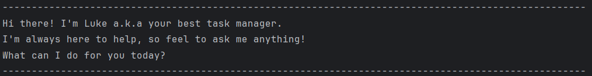

# Luke User Guide


Luke is a chatbot and task manager designed to help users stay organized effortlessly.
Using Luke, users can add, find, track and manage different types of tasks, such as to-dos,
deadlines, and events with ease.
It features a simple command-line interface and supports saving users' tasks automatically, so they will never
lose track of what needs to be done.

Ready to get started? Follow this guide to learn how to use Luke effectively.

## Features
> [!NOTE]
> - Words in `UPPER_CASE` are the parameters to be supplied by the user. <br>
    e.g. in `todo DESCRIPTION`, `DESCRIPTION` is a parameter which can be used as `todo do laundry`.
> - Every parameter must be supplied by the user. <br>
    e.g. if the command specifies `deadline DESCRIPTION /by DUE_DATE_TIME` , the user
    must fill in all parameters for the input to be valid.
> - Parameters must be entered in the specified order. <br>
    e.g. if the command specifies `DESCRIPTION /from START_DATE_TIME /to END_DATE_TIME`, the user
    must follow this exact sequence for the input to be valid.
> - Extraneous parameters for commands that do not take in parameters (such as `list` and `bye`) will be ignored. <br>
    e.g. if the command specifies `list 12345`, it will be interpreted as `list`.

## Adding a Todo: `todo`
Adds a todo task to the task list.

Format: `todo DESCRIPTION`

Example: `todo revise CS2113 OOP`

Expected output:
```
----------------------------------------------------------------------------------------------------
Yay! I've added this task for you: 
  [T][ ] revise CS2113 OOP
Now you have 1 tasks in the list.  
----------------------------------------------------------------------------------------------------
```

## Adding a Deadline: `deadline`
Adds a deadline task to the task list.

Format: `deadline DESCRIPTION /by DUE_DATE_TIME`
- `DUE_DATE_TIME` must follow this format: `yyyy-MM-dd HHmm`, where `yyyy` is year, `MM` is month,
  `dd` is day, and `HHmm` is time in 24-hour format

Example: `deadline submit CS2113 iP /by 2025-03-14 1600`

Expected output:
```
----------------------------------------------------------------------------------------------------
Yay! I've added this task for you: 
  [D][ ] submit CS2113 iP (by: Mar 14 2025, 4:00 PM)
Now you have 2 tasks in the list.
----------------------------------------------------------------------------------------------------
```

## Adding an Event: `event`
Adds an event to the task list.

Format: `event DESCRIPTION /from START_DATE_TIME /to END_DATE_TIME`
- `START_DATE_TIME` and `END_DATE_TIME` must follow this format: `yyyy-MM-dd HHmm`, where `yyyy` is year, `MM` is month,
  `dd` is day, and `HHmm` is time in 24-hour format

Example: `event orientation /from 2025-03-07 1000 /to 2025-03-07 2000`

Expected output:
```
----------------------------------------------------------------------------------------------------
Yay! I've added this task for you: 
  [E][ ] orientation (from: Mar 7 2025, 10:00 AM to: Mar 7 2025, 8:00 PM)
Now you have 3 tasks in the list.
----------------------------------------------------------------------------------------------------
```

## Listing all tasks: `list`
Shows a list of all tasks in the task list.

Format: `list`

Example: `list`

Expected output:
```
----------------------------------------------------------------------------------------------------
Here are the tasks in your list:
1.[T][ ] revise CS2113 OOP
2.[D][ ] submit CS2113 iP (by: Mar 14 2025, 4:00 PM)
3.[E][ ] orientation (from: Mar 7 2025, 10:00 AM to: Mar 7 2025, 8:00 PM)
----------------------------------------------------------------------------------------------------
```

## Marking a task as done: `mark`
Marks a specified task as done in the task list.

Format: `mark INDEX`
- Mark the task as done at the specified `INDEX`
- The index refers to the number assigned to a task in the displayed task list when using the `list` command.
- The index **must be a positive integer** 1, 2, 3, ...

Example: `list` followed by `mark 1` marks the 1st task as **done** in the task list.

Expected output of `mark 1`:
```
----------------------------------------------------------------------------------------------------
Nice! I've marked this task as done:
[T][X] revise CS2113 OOP
----------------------------------------------------------------------------------------------------
```

## Marking a task as not done: `unmark`
Marks a specified task as not done in the task list.

Format: `unmark INDEX`
- Mark the task as not done at the specified `INDEX`
- The index refers to the number assigned to a task in the displayed task list when using the `list` command.
- The index **must be a positive integer** 1, 2, 3, ...

Example: `list` followed by `unmark 1` marks the 1st task as **not done** in the task list.

Expected output of `unmark 1`:
```
----------------------------------------------------------------------------------------------------
Nice! I've marked this task as not done yet:
[T][ ] revise CS2113 OOP
----------------------------------------------------------------------------------------------------
```

## Deleting a task: `delete`
Delete a specified task from the task list.

Format: `delete INDEX`
- Deletes the task at the specified `INDEX`
- The index refers to the number assigned to a task in the displayed task list when using the `list` command.
- The index **must be a positive integer** 1, 2, 3, ...

Example: `list` followed by `delete 1` deletes the 1st task in the task list.

Expected output of `delete 1`:
```
----------------------------------------------------------------------------------------------------
There you go. I've removed this task for you:
  [T][ ] revise CS2113 OOP
Now you have 2 tasks in the list.
----------------------------------------------------------------------------------------------------
```

## Finding tasks by keyword: `find`
Finds tasks which descriptions contain the given keyword.

Format: `find KEYWORD`
- The search is case-insensitive. e.g. `book` will match `Book`
- Only the task description is searched.
- Partial word matches are allowed e.g. `bo` will match `book`
- Tasks matching the keyword will be returned. e.g. `book` will return `borrow book from Ethan`, `buy exercise book`
- If there is no matching task, a message indicating zero result will be displayed.

Example: `find book`

Expected output:
```
----------------------------------------------------------------------------------------------------
Here are the matching tasks in your list:
1.[T][ ] buy exercise book
2.[T][ ] borrow book from Ethan
----------------------------------------------------------------------------------------------------
```

## Finding tasks by date: `findDate`
Finds tasks with the specified date.

Format: `findDate DATE`
- `DATE` must follow this format: `yyyy-MM-dd`, where `yyyy` is year, `MM` is month, `dd` is day
- `Todo` tasks are not included in the search as they do not have a date.
- For `deadline` tasks, its `DUE_DATE_TIME` are checked.
- For `event` tasks, both the `START_DATE_TIME` and `END_DATE_TIME` are checked.
- Tasks with a matching date (`yyyy-MM-dd`) will be returned, regardless of the time (`HHmm`) in
  `DUE_DATE_TIME`, `START_DATE_TIME`, or `END_DATE_TIME`.

Example: `findDate 2025-03-07`

Expected output:
```
----------------------------------------------------------------------------------------------------
Here are the tasks on 2025-03-07:
1. [E][ ] orientation (from: Mar 7 2025, 10:00 AM to: Mar 7 2025, 8:00 PM)
----------------------------------------------------------------------------------------------------
```

## Exiting the program: `bye`
Exits the program.

Format: `bye`

Example: `bye`

Expected output:
```
----------------------------------------------------------------------------------------------------
It's my pleasure to help you. Hope to see you again soon! :')
----------------------------------------------------------------------------------------------------
```

## Saving the data
Luke data, i.e. tasks in the task list, are saved in the hard disk automatically after any command that changes the data.
There is no need to save manually.

## Editing the data file
Luke data, i.e. tasks in the task list, are saved automatically as a text file
[your current directory in Command Prompt]/data/tasks.txt.
Advanced users are welcome to update data directly by editing that data file.

> [!CAUTION] 
> If your changes to the data file makes its format invalid, Luke will skip that row,
> notify you and continue loading the next one.
> Consequently, the task list will not include the invalid task. <br>
> Therefore, only edit the data file if you are confident in making the correct updates.